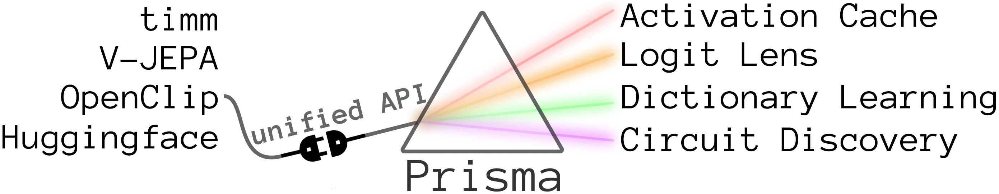

<div style="display: flex; align-items: center;">
  
</div>

# ViT-Prisma
This repo contains code for vision mechanistic interpretability, including activation caching and SAE training. We include pretrained SAE weights and transcoders on CLIP and DINO. More details are below.

# SAE Pretrained Weights and Evaluation Code

## SAE Demo Notebooks
Notebooks to load, train, and evaluate SAEs.
* [SAE loading notebook](https://github.com/Prisma-Multimodal/ViT-Prisma/blob/main/demos/1_Load_SAE.ipynb)
* [SAE training notebook](https://github.com/Prisma-Multimodal/ViT-Prisma/blob/main/demos/2_Train_SAE.ipynb)
* [SAE evaluation notebook](https://github.com/Prisma-Multimodal/ViT-Prisma/blob/main/demos/3_Evaluate_SAE.ipynb)

## Pretrained Vision SAE Suite
For a full list of SAEs, including CLIP top k, CLIP transcoders, and DINO SAEs for all layers, **see [here](https://github.com/Prisma-Multimodal/ViT-Prisma/blob/main/docs/sae_table.md)**. More details are in our whitepaper [here](https://arxiv.org/abs/2504.19475).

We recommend starting with the vanilla CLIP SAEs, which are the highest fidelity. If you are just getting started with steering CLIP's output, we recommend using [`layer-11-hook-resid-post`](https://huggingface.co/prisma-multimodal/sparse-autoencoder-clip-b-32-sae-vanilla-x64-layer-11-hook_resid_post-l1-1e-05).

More statistics about the vanilla SAEs are below:

### Vanilla SAEs (All Patches)

| Model | Layer | Sublayer   | l1 coeff. | % Explained var. | Avg L0  | Avg CLS L0 | Cos sim | Recon cos sim | CE    | Recon CE | Zero abl CE | % CE recovered | % Alive features |
|--------|-------|------------|-----------|------------------|---------|-------------|---------|----------------|--------|-----------|--------------|----------------|------------------|
| [link](https://huggingface.co/prisma-multimodal/sparse-autoencoder-clip-b-32-sae-vanilla-x64-layer-0-hook_mlp_out-l1-1e-05) | 0     | mlp_out    | 1e-5      | 98.7             | 604.44  | 36.92       | 0.994   | 0.998          | 6.762  | 6.762     | 6.779        | 99.51          | 100              |
| [link](https://huggingface.co/prisma-multimodal/sparse-autoencoder-clip-b-32-sae-vanilla-x64-layer-0-hook_resid_post-l1-1e-05) | 0     | resid_post | 1e-5      | 98.6             | 1110.9  | 40.46       | 0.993   | 0.988          | 6.762  | 6.763     | 6.908        | 99.23          | 100              |
| [link](https://huggingface.co/prisma-multimodal/sparse-autoencoder-clip-b-32-sae-vanilla-x64-layer-1-hook_mlp_out-l1-1e-05) | 1     | mlp_out    | 1e-5      | 98.4             | 1476.8  | 97.82       | 0.992   | 0.994          | 6.762  | 6.762     | 6.889        | 99.40          | 100              |
| [link](https://huggingface.co/prisma-multimodal/sparse-autoencoder-clip-b-32-sae-vanilla-x64-layer-1-hook_resid_post-l1-1e-05) | 1     | resid_post | 1e-5      | 98.3             | 1508.4  | 27.39       | 0.991   | 0.989          | 6.762  | 6.763     | 6.908        | 99.02          | 100              |
| [link](https://huggingface.co/prisma-multimodal/sparse-autoencoder-clip-b-32-sae-vanilla-x64-layer-2-hook_mlp_out-l1-1e-05) | 2     | mlp_out    | 1e-5      | 98.0             | 1799.7  | 376.0       | 0.992   | 0.998          | 6.762  | 6.762     | 6.803        | 99.44          | 100              |
| [link](https://huggingface.co/prisma-multimodal/sparse-autoencoder-clip-b-32-sae-vanilla-x64-layer-2-hook_resid_post-l1-5e-05) | 2     | resid_post | 5e-5      | 90.6             | 717.84  | 10.11       | 0.944   | 0.960          | 6.762  | 6.767     | 6.908        | 96.34          | 100              |
| [link](https://huggingface.co/prisma-multimodal/sparse-autoencoder-clip-b-32-sae-vanilla-x64-layer-3-hook_mlp_out-l1-1e-05) | 3     | mlp_out    | 1e-5      | 98.1             | 1893.4  | 648.2       | 0.992   | 0.999          | 6.762  | 6.762     | 6.784        | 99.54          | 100              |
| [link](https://huggingface.co/prisma-multimodal/sparse-autoencoder-clip-b-32-sae-vanilla-x64-layer-3-hook_resid_post-l1-1e-05) | 3     | resid_post | 1e-5      | 98.1             | 2053.9  | 77.90       | 0.989   | 0.996          | 6.762  | 6.762     | 6.908        | 99.79          | 100              |
| [link](https://huggingface.co/prisma-multimodal/sparse-autoencoder-clip-b-32-sae-vanilla-x64-layer-4-hook_mlp_out-l1-1e-05) | 4     | mlp_out    | 1e-5      | 98.1             | 1901.2  | 1115.0      | 0.993   | 0.999          | 6.762  | 6.762     | 6.786        | 99.55          | 100              |
| [link](https://huggingface.co/prisma-multimodal/sparse-autoencoder-clip-b-32-sae-vanilla-x64-layer-4-hook_resid_post-l1-1e-05) | 4     | resid_post | 1e-5      | 98.0             | 2068.3  | 156.7       | 0.989   | 0.997          | 6.762  | 6.762     | 6.908        | 99.74          | 100              |
| [link](https://huggingface.co/prisma-multimodal/sparse-autoencoder-clip-b-32-sae-vanilla-x64-layer-5-hook_mlp_out-l1-1e-05) | 5     | mlp_out    | 1e-5      | 98.2             | 1761.5  | 1259.0      | 0.993   | 0.999          | 6.762  | 6.762     | 6.797        | 99.76          | 100              |
| [link](https://huggingface.co/prisma-multimodal/sparse-autoencoder-clip-b-32-sae-vanilla-x64-layer-5-hook_resid_post-l1-1e-05) | 5     | resid_post | 1e-5      | 98.1             | 1953.8  | 228.5       | 0.990   | 0.997          | 6.762  | 6.762     | 6.908        | 99.80          | 100              |
| [link](https://huggingface.co/prisma-multimodal/sparse-autoencoder-clip-b-32-sae-vanilla-x64-layer-6-hook_mlp_out-l1-1e-05) | 6     | mlp_out    | 1e-5      | 98.3             | 1598.0  | 1337.0      | 0.993   | 0.999          | 6.762  | 6.762     | 6.789        | 99.83          | 100              |
| [link](https://huggingface.co/prisma-multimodal/sparse-autoencoder-clip-b-32-sae-vanilla-x64-layer-6-hook_resid_post-l1-1e-05) | 6     | resid_post | 1e-5      | 98.2             | 1717.5  | 321.3       | 0.991   | 0.996          | 6.762  | 6.762     | 6.908        | 99.93          | 100              |
| [link](https://huggingface.co/prisma-multimodal/sparse-autoencoder-clip-b-32-sae-vanilla-x64-layer-7-hook_mlp_out-l1-1e-05) | 7     | mlp_out    | 1e-5      | 98.2             | 1535.3  | 1300.0      | 0.992   | 0.999          | 6.762  | 6.762     | 6.796        | 100.17         | 100              |
| [link](https://huggingface.co/prisma-multimodal/sparse-autoencoder-clip-b-32-sae-vanilla-x64-layer-7-hook_resid_post-l1-1e-05) | 7     | resid_post | 1e-5      | 98.2             | 1688.4  | 494.3       | 0.991   | 0.995          | 6.762  | 6.761     | 6.908        | 100.24         | 100              |
| [link](https://huggingface.co/prisma-multimodal/sparse-autoencoder-clip-b-32-sae-vanilla-x64-layer-8-hook_mlp_out-l1-1e-05) | 8     | mlp_out    | 1e-5      | 97.8             | 1074.5  | 1167.0      | 0.990   | 0.998          | 6.762  | 6.761     | 6.793        | 100.57         | 100              |
| [link](https://huggingface.co/prisma-multimodal/sparse-autoencoder-clip-b-32-sae-vanilla-x64-layer-8-hook_resid_post-l1-1e-05) | 8     | resid_post | 1e-5      | 98.2             | 1570.8  | 791.3       | 0.991   | 0.992          | 6.762  | 6.761     | 6.908        | 100.41         | 100              |
| [link](https://huggingface.co/prisma-multimodal/sparse-autoencoder-clip-b-32-sae-vanilla-x64-layer-9-hook_mlp_out-l1-1e-05) | 9     | mlp_out    | 1e-5      | 97.6             | 856.68  | 1076.0      | 0.989   | 0.998          | 6.762  | 6.762     | 6.792        | 100.28         | 100              |
| [link](https://huggingface.co/prisma-multimodal/sparse-autoencoder-clip-b-32-sae-vanilla-x64-layer-9-hook_resid_post-l1-1e-05) | 9     | resid_post | 1e-5      | 98.2             | 1533.5  | 1053.0      | 0.991   | 0.989          | 6.762  | 6.761     | 6.908        | 100.32         | 100              |
| [link](https://huggingface.co/prisma-multimodal/sparse-autoencoder-clip-b-32-sae-vanilla-x64-layer-10-hook_mlp_out-l1-1e-05) | 10    | mlp_out    | 1e-5      | 98.1             | 788.49  | 965.5       | 0.991   | 0.998          | 6.762  | 6.762     | 6.772        | 101.50         | 99.80            |
| [link](https://huggingface.co/prisma-multimodal/sparse-autoencoder-clip-b-32-sae-vanilla-x64-layer-10-hook_resid_post-l1-1e-05) | 10    | resid_post | 1e-5      | 98.4             | 1292.6  | 1010.0      | 0.992   | 0.987          | 6.762  | 6.760     | 6.908        | 100.83         | 99.99            |
| [link](https://huggingface.co/prisma-multimodal/sparse-autoencoder-clip-b-32-sae-vanilla-x64-layer-11-hook_mlp_out-l1-5e-05) | 11    | mlp_out    | 5e-5      | 89.7             | 748.14  | 745.5       | 0.972   | 0.993          | 6.762  | 6.759     | 6.768        | 135.77         | 100              |
| [link](https://huggingface.co/prisma-multimodal/sparse-autoencoder-clip-b-32-sae-vanilla-x64-layer-11-hook_resid_post-l1-1e-05) | 11    | resid_post | 1e-5      | 98.4             | 1405.0  | 1189.0      | 0.993   | 0.987          | 6.762  | 6.765     | 6.908        | 98.03          | 99.99            |


# Vision Transformer (ViT) Prisma Library
<div style="display: flex; align-items: center;">
  
  
  
</div>

For a full introduction, including Open Problems in vision mechanistic interpretability, see the original Less Wrong post [here](https://www.lesswrong.com/posts/kobJymvvcvhbjWFKe/laying-the-foundations-for-vision-and-multimodal-mechanistic).

ViT Prisma is an open-source mechanistic interpretability library for vision and multimodal models. Currently, the library supports ViTs and CLIP. This library was created by [Sonia Joseph](https://twitter.com/soniajoseph_). ViT Prisma is largely based on [TransformerLens](https://github.com/neelnanda-io/TransformerLens) by Neel Nanda.

*Contributors:* [Praneet Suresh](https://github.com/PraneetNeuro), [Yash Vadi](https://github.com/YashVadi), [Rob Graham](https://github.com/themachinefan), [Lorenz Hufe](https://github.com/lowlorenz), [Edward Stevinson](https://github.com/stevinson), and [Ethan Goldfarb](https://github.com/ekg15), _and more coming soon_. You learn more about our contributions on our [Contributors page](https://github.com/soniajoseph/ViT-Prisma/blob/main/docs/PRISMA_CONTRIBUTORS.md) (coming soon).

We welcome new contributors. Check out our contributing guidelines [here](CONTRIBUTING.md) and our [open Issues](https://github.com/soniajoseph/ViT-Prisma/issues).

## Installing Repo

For the latest version, install the repo from the source. While this version will include the latest developments, they may not be fully tested.

For the tested and stable release, install Prisma as a package.

**Install as a package**
Installing with pip:
```
pip install vit_prisma
```

**Install from source**
To install as an editable repo from source:
```
git clone https://github.com/soniajoseph/ViT-Prisma
cd ViT-Prisma
pip install -e .
```

## How do I use this repo?
Check out [our guide](https://github.com/soniajoseph/ViT-Prisma/blob/main/docs/UsageGuide.md).

Check out our tutorial notebooks for using the repo. You can also check out this [corresponding talk](https://youtu.be/gQbh-RZtsq4?t=0) on some of these techniques.

1. [Main ViT Demo](https://colab.research.google.com/drive/1TL_BY1huQ4-OTORKbiIg7XfTyUbmyToQ) - Overview of main mechanistic interpretability technique on a ViT, including direct logit attribution, attention head visualization, and activation patching. The activation patching switches the net's prediction from tabby cat to Border collie with a minimum ablation.
2. [Emoji Logit Lens](https://colab.research.google.com/drive/1yAHrEoIgkaVqdWC4GY-GQ46ZCnorkIVo) - Deeper dive into layer- and patch-level predictions with interactive plots.
3. [Interactive Attention Head Tour](https://colab.research.google.com/drive/1P252fCvTHNL_yhqJDeDVOXKCzIgIuAz2) - Deeper dive into the various types of attention heads a ViT contains with interactive JavaScript.

## Features

For a full demo of Prisma's features, including the visualizations below with interactivity, check out the demo notebooks above.

### Attention head visualization


<div style="display: flex; align-items: center;">
  
  
  
</div>

### Activation patching


### Direct logit attribution


### Emoji logit lens
<div style="display: flex; align-items: center;">


</div>


## Supported Models
* [timm ViTs](https://github.com/huggingface/pytorch-image-models/blob/main/timm/models/vision_transformer.py)
* [CLIP](https://huggingface.co/docs/transformers/main/en/model_doc/clip)
* Our custom toy models (see below)

## Training Code

Prisma contains training code to train your own custom ViTs. Training small ViTs can be very useful when isolating specific behaviors in the model.

For training your own models, check out [our guide](https://github.com/soniajoseph/ViT-Prisma/blob/main/docs/UsageGuide.md).

## Custom Models & Checkpoints

### ImageNet-1k classification checkpoints (patch size 32)

This model was trained by Praneet Suresh. All models include training checkpoints, in case you want to analyze training dynamics.

This larger patch size ViT has inspectable attention heads; else the patch size 16 attention heads are too large to easily render in JavaScript.


| **Size** | **NumLayers** | **Attention+MLP** | **AttentionOnly** | **Model Link**                              |
|:--------:|:-------------:|:-----------------:|:-----------------:|--------------------------------------------|
| **tiny** | **3**         | 0.22 \| 0.42 |            N/A            | [Attention+MLP](https://huggingface.co/PraneetNeuro/ImageNet-Small-Attention-and-MLP-Patch32) |

### ImageNet-1k classification checkpoints (patch size 16)

The detailed training logs and metrics can be found [here](https://wandb.ai/vit-prisma/Imagenet/overview?workspace=user-yash-vadi). These models were trained by Yash Vadi.

**Table of Results**

Accuracy `[ <Acc> | <Top5 Acc> ]`

| **Size** | **NumLayers** | **Attention+MLP** | **AttentionOnly** | **Model Link**                              |
|:--------:|:-------------:|:-----------------:|:-----------------:|--------------------------------------------|
| **tiny** | **1**         | 0.16 \| 0.33             |  0.11 \| 0.25             | [AttentionOnly](https://huggingface.co/IamYash/ImageNet-tiny-AttentionOnly), [Attention+MLP](https://huggingface.co/IamYash/ImageNet-tiny-Attention-and-MLP) |
| **base** | **2**         | 0.23 \| 0.44             |  0.16 \| 0.34             | [AttentionOnly](https://huggingface.co/IamYash/ImageNet-base-AttentionOnly), [Attention+MLP](https://huggingface.co/IamYash/ImageNet-base-Attention-and-MLP) |
| **small**| **3**         | 0.28 \| 0.51            | 0.17 \| 0.35             | [AttentionOnly](https://huggingface.co/IamYash/ImageNet-small-AttentionOnly), [Attention+MLP](https://huggingface.co/IamYash/ImageNet-small-Attention-and-MLP) |
| **medium**|**4**         | 0.33 \| 0.56             | 0.17 \| 0.36             | [AttentionOnly](https://huggingface.co/IamYash/ImageNet-medium-AttentionOnly), [Attention+MLP](https://huggingface.co/IamYash/ImageNet-medium-Attention-and-MLP) |

### dSprites Shape Classification training checkpoints

Original dataset is [here](https://github.com/google-deepmind/dsprites-dataset). 

Full results and training setup are [here](https://github.com/soniajoseph/ViT-Prisma/blob/main/docs/experiments/dSprites_results.md). These models were trained by Yash Vadi.

**Table of Results**
| **Size** | **NumLayers** | **Attention+MLP** | **AttentionOnly** | **Model Link**                              |
|:--------:|:-------------:|:-----------------:|:-----------------:|--------------------------------------------|
| **tiny** | **1**         | 0.535             | 0.459             | [AttentionOnly](https://huggingface.co/IamYash/dSprites-tiny-AttentionOnly), [Attention+MLP](https://huggingface.co/IamYash/dSprites-tiny-Attention-and-MLP) |
| **base** | **2**         | 0.996             | 0.685             | [AttentionOnly](https://huggingface.co/IamYash/dSprites-base-AttentionOnly), [Attention+MLP](https://huggingface.co/IamYash/dSprites-base-Attention-and-MLP) |
| **small**| **3**         | 1.000             | 0.774             | [AttentionOnly](https://huggingface.co/IamYash/dSprites-small-AttentionOnly), [Attention+MLP](https://huggingface.co/IamYash/dSprites-small-Attention-and-MLP) |
| **medium**|**4**         | 1.000             | 0.991             | [AttentionOnly](https://huggingface.co/IamYash/dSprites-medium-AttentionOnly), [Attention+MLP](https://huggingface.co/IamYash/dSprites-medium-Attention-and-MLP) |


## Guidelines for training + uploading models

Upload your trained models to Huggingface. Follow the [Huggingface guidelines](https://huggingface.co/docs/hub/models-uploading) and also create a model card. Document as much of the training process as possible including links to loss and accuracy curves on weights and biases, dataset (and order of training data), hyperparameters, optimizer, learning rate schedule, hardware, and other details that may be relevant. 

Include frequent checkpoints throughout training, which will help other researchers understand training dynamics.


# Citation

Please cite this repository when used in papers or research projects.

```
@misc{

}
```

```
@misc{joseph2023vit,
  author = {Sonia Joseph},
  title = {ViT Prisma: A Mechanistic Interpretability Library for Vision Transformers},
  year = {2023},
  publisher = {GitHub},
  journal = {GitHub repository},
  howpublished = {\url{https://github.com/soniajoseph/vit-prisma}}
}
```

# License

We have an MIT license [here](https://github.com/soniajoseph/ViT-Prisma/blob/main/LICENSE).
